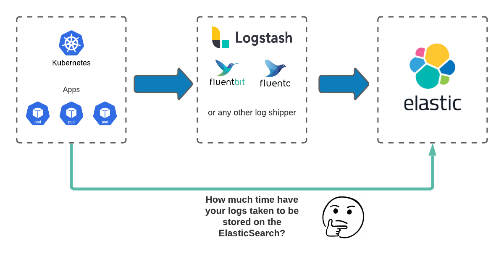
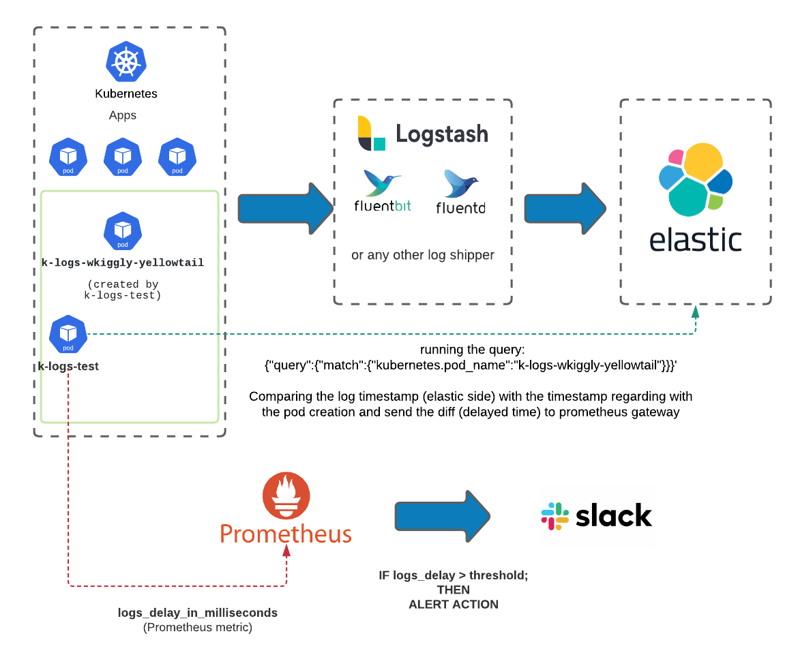

## K-Logs-Test


K-logs-test helps you to be sure that your applications logs are getting into their destination (ElasticSearch) in a proper period of time.





In case the logs are taking more time than your team accept, k-logs-test will identify the problem before and notify you.
Also you can use the metrics exposed by the Prometheus Gateway.




#### How it works?

k-logs-test will create a pod in your kubernetes in a namespace you've defined.


#### How to use the k-logs-test?

#### CLI Mode:

Example:

```
k-logs-test run -p tatata -e http://localhost:9200/test_logs --logs-hits 4 --threshold 3 --channel "#k-logs" --webhook-url https://hooks.slack.com/services/XXXX/XXXX/XXXXX --slack-alert-enabled true
```

#### Command args reference

```
k-logs-test run --help

Usage:
  k-logs-test run [flags]

Flags:
  -c, --channel string            The Slack Channel for notification (default "#k-logs")
  -e, --elastic-endpoint string   The ElasticSearch Endpoint and the logs index name (default "https://localhost:9200/fluentd")
  -h, --help                      Help option
      --logs-hits int             The number of logs hits (default 30)
  -n, --namespace string          The pod namespace (default "default")
  -p, --pod-name string           The pod name (default "k-logs-test")
  -a, --slack-alert-enabled       Enable or Disable Slack Alerts
      --threshold int             The Alert Threshould in milliseconds
  -w, --webhook-url string        The Slack Webhook Url for notification
      --prom-enabled bool         Enable or Disable Prometheus metric (default "false") 
      --prom-endpoint string      The prometheus gateway addr

  

Global Flags:
      --config string   config file (default is $HOME/.k-logs-test.yaml)
```

You can also export env vars:

```
export K_LOGS_LOGS_HITS=30
export K_LOGS_CHANNEL="#k-logs"
export K_LOGS_ELASTIC_ENDPOINT="https://localhost:9200/fluentd"
export K_LOGS_NAMESPACE="monitoring"
export K_LOGS_POD_NAME="test-logs"
export K_LOGS_SLACK_ALERT_ENABLED="true"
export K_LOGS_THRESHOLD="2000"
export K_LOGS_WEBHOOK_URL="https://hooks.slack.com/services/XXXXXXX/YYYYYY/WWWWW"
export K_LOGS_PROM_ENABLED="true"
export K_LOGS_PROM_ENDPOINT="localhost"
```

And then just run the k-logs-test run without to set the flags.

```
k-logs-test run
```

#### Kubernetes Installation

##### Helm Chart

WIP

